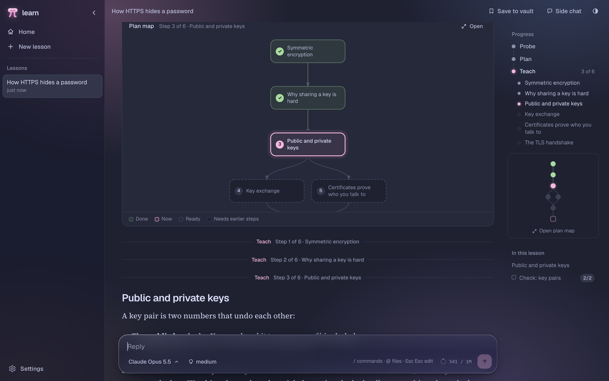
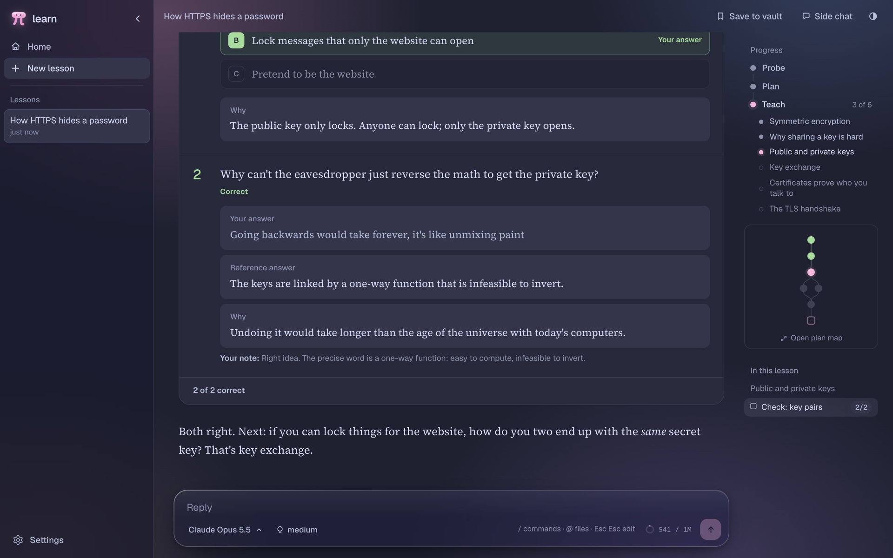

<p align="center"></p>

<h1 align="center">Learn</h1>

Learn turns [amosblomqvist/learn](https://github.com/amosblomqvist/learn), Amos Blomqvist's AI learning system from his video [How I Use AI to Learn Things](https://www.youtube.com/watch?v=kzcI5F4tGiU), into a local app. It runs his teaching skill and his research and diagram agents on [pi](https://www.npmjs.com/package/@earendil-works/pi-coding-agent), and adds worksheets, quizzes, a lesson outline, a plan map and a side chat. Everything stays on your computer; the server only listens on 127.0.0.1.

<p align="center"></p>
<p align="center"></p>

## Install

Download Learn for your system from [Releases](https://github.com/j0team/learn/releases), unzip it and open it. On first launch it asks for a notes folder: the tutor reads and writes files there and saves lessons into it. Then add a model provider in **Settings → Providers**: sign in with a Claude Pro/Max or ChatGPT subscription, or add an API endpoint. Credentials stay in pi's `~/.pi/agent/auth.json`.

Builds aren't signed yet, so macOS asks you to allow Learn once in **System Settings → Privacy & Security → Open Anyway**, and Windows asks you to confirm it. On Windows, also install [Git for Windows](https://git-scm.com/download/win): the tutor runs its shell commands in Git Bash.

Learn is developed on macOS and runs on Windows and Linux too, though those get less testing.

Optional extras:

- Web research: `pi install npm:pi-web-access`
- Diagrams: `rsvg-convert` (librsvg) or ImageMagick. Mermaid diagrams also need Chrome or Chromium and only render when running from source.

### Claude subscriptions

`extensions/claude-subscription.mjs` sends Claude subscription requests through [oh-my-pi's Anthropic provider](https://github.com/can1357/oh-my-pi/tree/main/packages/ai), which mimics Claude Code's requests. Anthropic may not treat this as permitted subscription use; use it at your own risk. API keys and custom endpoints use pi's normal transport.

## Development

### Run from source

Learn also runs as a local web page. Needs Node 22.19 or newer; `npm install` brings its own pi and Bun.

```sh
git clone https://github.com/j0team/learn
cd learn
npm install
npm run build
LEARN_VAULT=~/notes npm start
```

Then open http://localhost:4747.

| Variable | Default | |
|---|---|---|
| `LEARN_VAULT` | current directory | Notes folder the tutor reads and writes |
| `LEARN_PORT` | `4747` | Port |
| `LEARN_SESSIONS` | `~/.pi/agent/learn-sessions` | Where lessons are saved |
| `LEARN_PI` | bundled pi under Bun | pi executable |
| `LEARN_PI_ARGS` | | Extra pi arguments |

### Working on Learn

```sh
LEARN_PORT=4750 npm start                     # API server
LEARN_API=http://127.0.0.1:4750 npm run dev   # UI with hot reload
npm test                                      # server and extension tests
npm run lint
npm run app:dev                               # Electron window from the checkout
npm run app                                   # package the app for this system into release/
```

The app bundles each system's Bun, so it's built on the system it's for; `.github/workflows/build.yml` builds all four and attaches them to a release when a `v*` tag is pushed.

- `server/`: the Bun server (`server.mjs`), the pi extension with Learn's tools (`learn.ts`) and the tutor prompts
- `src/`: the React UI (Tailwind theme in `src/index.css`, shared state in `src/lib/store.ts`)
- `skills/` and `agents/`: the tutor's skills and the subagents they call (a researcher and two diagram makers)
- `extensions/`: the Claude subscription transport and the diagram render tools
- `electron/`: the desktop app

## Roadmap

- Signed builds

## Credits

The teaching approach, the `teach` skill and the subagents come from [amosblomqvist/learn](https://github.com/amosblomqvist/learn) by Amos Blomqvist. Watch [his video](https://www.youtube.com/watch?v=kzcI5F4tGiU) for the ideas behind it.

## License

MIT. See [LICENSE](LICENSE).
